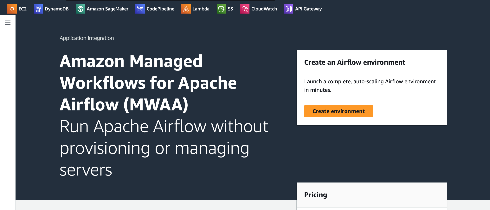
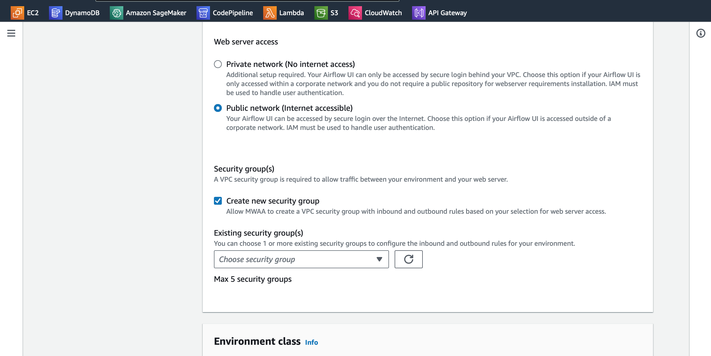

# Setting Up Apache Airflow on AWS Managed Apache Airflow (MWAA)
This repository provides a guide on how to set up and use Apache Airflow on AWS Managed Apache Airflow (MWAA). Follow the steps below to get started.
# Steps
# 1. Open AWS Console
Log in to your AWS Console and search for "Managed Apache Airflow" or navigate to it directly.

# 2. Create an Airflow Environment
- Click on the "Create environment" button.
- Enter a name for your environment.
- Ensure your DAGs are stored in an S3 bucket.

# 3. Set Up an S3 Bucket
- Create an S3 bucket in your AWS account if you don't have one.
- Inside the bucket, create a folder named "Dags."
- Place your Airflow DAGs in the "Dags" folder.

# 4. Specify S3 Bucket and DAGs Folder
While creating your Airflow environment, specify the S3 bucket name and the "Dags" folder where your DAGs are stored.

# 5. Configure Networking
- Choose your existing Virtual Private Cloud (VPC) and two private subnets.
- If you don't have an existing VPC, you can create one by clicking the "MWAA VPC" button.

# 6. Configure Security
Select the public network and either create a new security group or choose an existing one.

# 7. Define Environment Settings
- Choose the environment class and the number of workers based on your requirements.

- Create a new IAM role or select an existing one for MWAA.

 

# 8. Review and Create an Environment
- Review all the details you've provided.
- Click the "Create environment" button.
- It may take 20-30 minutes for AWS to set up your Apache Airflow environment.

# 9. Access Airflow UI
- Once the environment is created, open the Airflow UI URL provided.
- This URL will redirect you to the Apache Airflow user interface.

 

Here, you will find all your DAGs and can start managing your workflows.

 

### Congratulations! You've successfully set up Apache Airflow on AWS Managed Apache Airflow. You can now use this environment to manage and schedule your data workflows.
